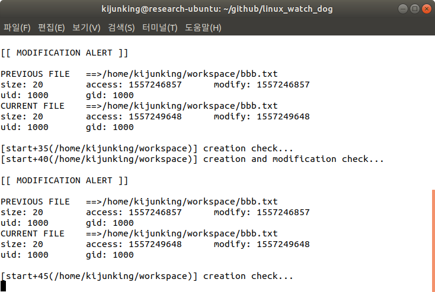

# Linux watch dog
Watchdog consists of two handle the signal functions(`-handler`) and two watch the directory functions(`-detect` functions). First, `destructor_handler` accept the SIGINT for serve the end of the program. So, it has the memory deallocation.

As you can see my program uses glib. Because this makes easier to control the data structure and flow of this program. So, If you want to compile this program. You have to add the flags which relates in glib. For instance, below table is about my makefile setting.

Second, `task_handler` accepts the SIGALRM to every 5s. Strangely, this function has the boolean variable related in the every 10s. Because This function wakes every 5 seconds. So, we only care about check the every 10s. And according to the requirements, I implement that detect the modification in every 10 seconds and the create in every 5 seconds.

Third, `modify_detect` and `create_detect` implement based on the inode. I assume that inode number cannot be changed. So I use that. One checks the modify with file's stat struct and path, the other checks the creation based on check the existence in the list's file.

